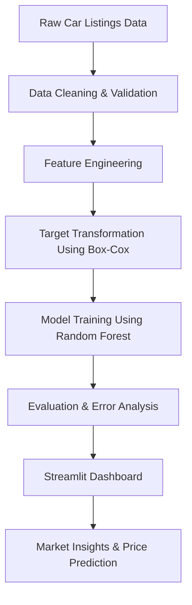

# 🚗 Car Resale Price Prediction & Market Intelligence Dashboard

## Overview

**Car Sales Intelligence** is an end-to-end data science project that combines **exploratory market analysis**, **statistical modeling**, and **machine learning–based price prediction** into a single interactive Streamlit dashboard.

The project is designed to simulate a **real-world resale pricing system**, exposing both **market-level insights** and **instance-level predictions**, while maintaining statistical rigor and interpretability.

**Primary goals:**

* Analyze resale market behavior across brands, fuel types, and years
* Address skewed price distributions using statistical transformations
* Train a robust ML regression model for resale price estimation
* Deliver insights and predictions through an interactive dashboard

---

## Architecture

### System Flow

---

### Component Breakdown

| Component                             | Purpose                                                                         |
| ------------------------------------- | ------------------------------------------------------------------------------- |
| **Data Ingestion Layer**              | Loads raw resale listings and validates schema, ranges, and missing values.     |
| **Preprocessing Layer**               | Cleans data, selects features, encodes categoricals, and prepares model inputs. |
| **Statistical Transformation Engine** | Applies Box-Cox transformation to normalize resale price distribution.          |
| **Modeling Engine**                   | Trains and evaluates a Random Forest Regressor on transformed targets.          |
| **Evaluation Layer**                  | Computes MAE and constructs error-aware prediction ranges.                      |
| **Dashboard Layer (Streamlit)**       | Provides interactive market analysis and real-time price predictions.           |

---

## Dataset Description

The dataset represents **used car resale listings**, containing both vehicle specifications and transactional attributes.

**Target Variable:**

* `resale_price` (USD)

**Feature Categories:**

* Vehicle specifications (engine capacity, power, seats)
* Usage metrics (kilometers driven, mileage)
* Registration metadata (year)
* Categorical attributes (fuel type, transmission, body type, owner type, insurance)

| Column                     | Non-Null Count | Dtype   |
| -------------------------- | -------------- | ------- |
| full_name                  | 16,733         | object  |
| resale_price               | 16,733         | float64 |
| registered_year            | 16,733         | float64 |
| engine_capacity            | 16,733         | float64 |
| insurance                  | 16,733         | object  |
| transmission_type          | 16,733         | object  |
| kms_driven                 | 16,733         | float64 |
| owner_type                 | 16,733         | object  |
| fuel_type                  | 16,733         | object  |
| seats                      | 16,733         | float64 |
| mileage                    | 16,733         | object  |
| body_type                  | 16,733         | object  |
| city                       | 16,733         | object  |
| registered_year_Imputation | 16,733         | float64 |
| km_group                   | 16,733         | object  |
| max_power_clean_bhp        | 16,733         | float64 |
| mileage_number             | 16,733         | float64 |
| mileage_unit               | 16,733         | object  |
| boxcox_resale_price        | 16,733         | float64 |
| owner_rank                 | 16,733         | int64   |
| price_per_km               | 16,733         | float64 |

---

## Exploratory Data Analysis (EDA)

EDA was performed to understand:

* Price distribution skewness and outliers
* Brand-level resale dominance
* Fuel-type market composition
* Temporal price trends

Key findings:

* Resale prices exhibit strong right skew
* Brand contribution is highly imbalanced
* Fuel type significantly impacts resale value
* Older vehicles show non-linear depreciation patterns

---

---

## Feature Engineering & Preprocessing

This stage focuses on transforming raw attributes into **model-ready features**.

Key steps:

* Removal of duplicates and invalid price entries
* Separation of numerical and categorical features
* Numerical feature scaling
* Categorical feature encoding
* Preservation of feature consistency for inference

---

## Target Variable Transformation

Resale prices violate normality assumptions required for stable regression learning.

To address this:

* **Box-Cox transformation** was applied to the target variable
* Transformation stabilizes variance and improves model generalization
* Inverse transformation is applied during prediction to return prices in USD

---

## Model Selection

### Chosen Model: Random Forest Regressor

**Rationale:**

* Captures non-linear relationships
* Robust to outliers
* Strong performance on tabular, mixed-feature datasets
* Minimal feature scaling sensitivity

Alternative models were considered but deprioritized due to interpretability or robustness constraints.

---

## Model Training & Evaluation

**Training Strategy:**

* Train–test split
* Fixed random state for reproducibility

**Evaluation Metric:**

* Mean Absolute Error (MAE)

**Performance Interpretation:**

* MAE represents expected deviation from true resale price
* Used directly to construct prediction confidence ranges in the dashboard

| Model                |	R2     | MSE    |
| ElasticNet ML Linear |	0.6724 | 0.0014 |
| Random Forest	       |  0.8244 | 0.0007 |

---

---

## Streamlit Dashboard Overview

The Streamlit application acts as both:

* An **analytics dashboard** for market insights
* A **prediction interface** for individual vehicle pricing

It is designed for **non-technical users** while preserving data science transparency.

---

## Dashboard Pages

### 1️⃣ Car Sales Intelligence

Provides a **macro-level view** of the resale market.

Includes:

* Average, minimum, and maximum resale prices
* Total listings analyzed
* Fuel-type market share
* Year-wise top brand performance
* Historical price trends

---

### 2️⃣ Brand Deep-Dive Analysis

Focused on **distributional and brand-level insights**.

Includes:

* Resale price distribution histograms
* Original vs Box-Cox transformed prices
* Total sales value aggregated by brand

---

---

### 3️⃣ AI Price Predictor

An interactive inference tool powered by the trained ML model.

User inputs:

* Vehicle specifications
* Ownership and insurance details

Outputs:

* Predicted resale price
* Expected price range based on MAE
* Transformation-aware inverse prediction

---

---

---

## Design Decisions & Trade-offs

* Box-Cox transformation chosen over log due to flexibility
* Random Forest selected for robustness over linear interpretability
* MAE preferred over RMSE for real-world pricing clarity

---

## Limitations

* No regional price segmentation
* No temporal retraining pipeline
* Dataset assumes consistent market conditions

## Kaggle
https://www.kaggle.com/code/ahmedemasha/car-sales-analysis-price-prediction
